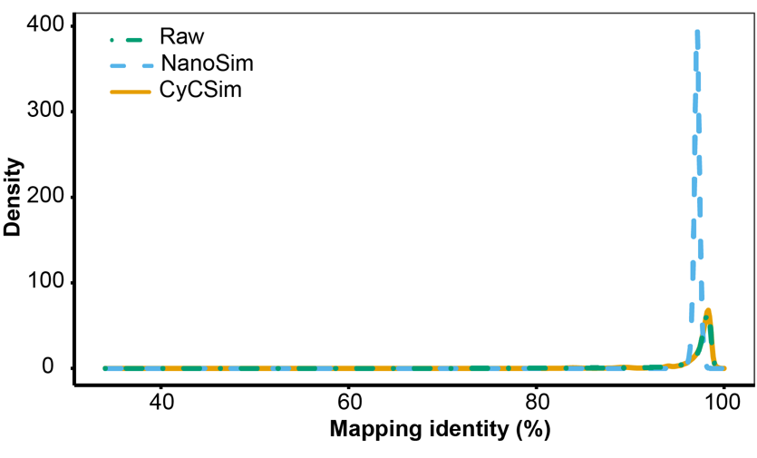
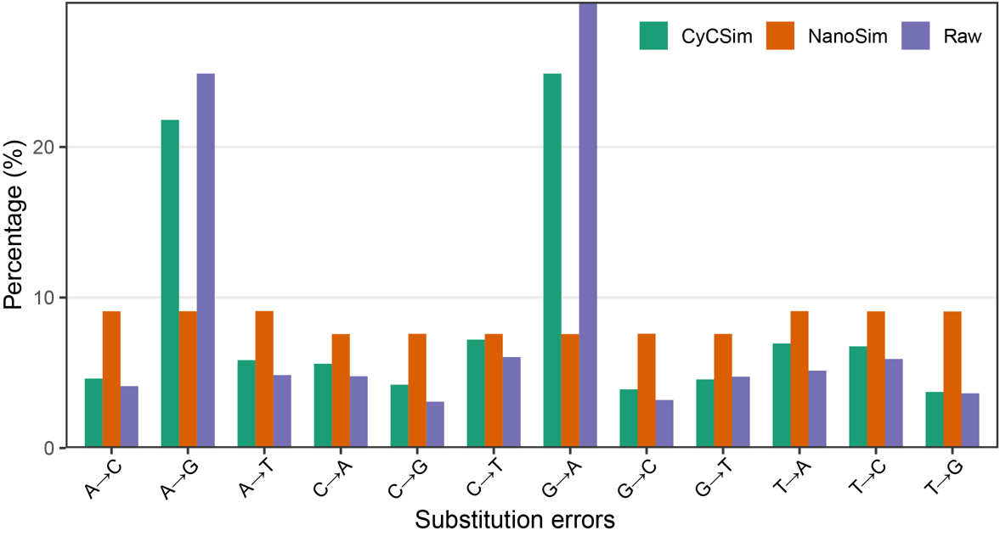
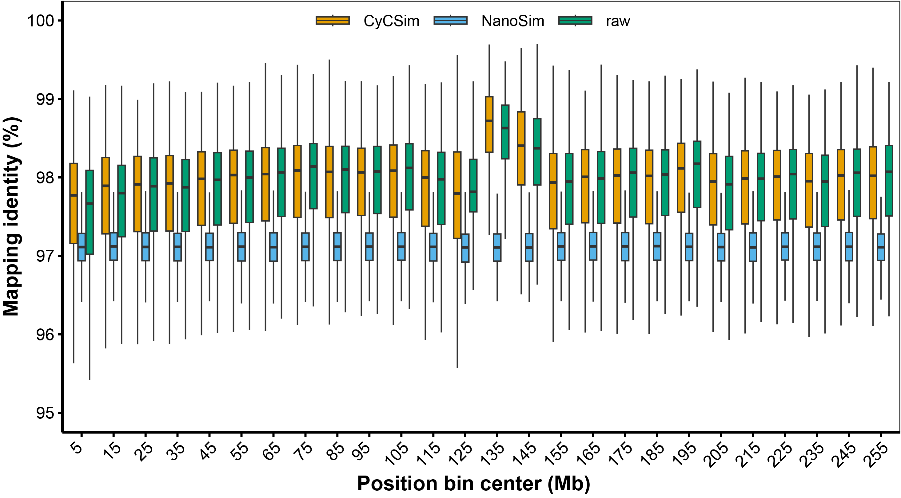

# CycSim - a context-based long-read simulator

Errors in long-read sequencing data are often context-dependent, with certain bases more prone to specific errors. Most existing simulators introduce errors randomly and thus fail to accurately capture these error patterns, only roughly simulating overall error rates. `CycSim` addresses this by modeling errors based on k-mer context, enabling more realistic simulation of sequencing error characteristics.

`CycSim` is easy to train and supports all types of long-read sequencing data. It currently provides pre-trained models for BGI CycloneSEQ, PacBio HiFi, and Oxford Nanopore Q20 data. Users can also quickly train their own custom models using a BAM file of reads aligned to a reference genome.

## Table of Contents

- [Installation](#install)
- [General usage](#usage)
- [Getting help](#help)
- [Limitations](#limit)
- [Benchmarking](#benchmark)

### <a name="install"></a>Installation
<!-- 
#### Installing from bioconda
```sh
conda install nextpolish2
``` -->
#### Installing from source
##### Dependencies

`CycSim` is written in rust, try below commands (no root required) or refer [here](https://www.rust-lang.org/tools/install) to install `Rust` first.
```sh
curl --proto '=https' --tlsv1.2 -sSf https://sh.rustup.rs | sh
```

##### Download and install
国内用户请参考[这里](https://mirrors.tuna.tsinghua.edu.cn/help/crates.io-index/)设置清华源加速
```sh
git clone https://github.com/BioEarthDigital/CycSim.git
cd CycSim && cargo build --release
```

##### Test

```sh
cd test && bash hh.sh
```

#### Download pre-trained models
```sh
# BGI CycloneSEQ model
# PacBio HiFi model
# Oxford Nanopore Q20 data model
```

### <a name="usage"></a>General usage
#### Simulation
`CycSim` takes a genome assembly file and a trained model file as input to generate simulated reads in BAM format.

```sh
./target/release/cycsim sim -t 60 -d 30 model.cy ref.fa -o sim.bam
```

***Note:*** If you need to simulate more than 50× coverage (i.e., more than the depth used for training), it is recommended to add the `-n` option. This will introduce additional random errors and help avoid oversampling artifacts.

#### Training

`CycSim` can be trained to build an error model from real sequencing data. It takes a genome assembly file and a read mapping file in BAM format as input (sorting is not required) and produces a trained model file.

```sh
./target/release/cycsim train -t 60 -r nanopore read.bam ref.fa -o model.cy
```

Use `./target/release/cycsim -h` to see options.

### <a name="help"></a>Getting help

#### Help

   Feel free to raise an issue at the [issue page](https://github.com/BioEarthDigital/CycSim/issues/new).

   ***Note:*** Please ask questions on the issue page first. They are also helpful to other users.
#### Contact
   
   For additional help, please send an email to hujiang\_at\_genomics\_dot\_cn.

<!-- ### <a name="cite"></a>Citation -->


### <a name="limit"></a>Limitations

1. `CycSim` currently supports training and simulation only in whole-genome sequencing (WGS) scenarios.

### <a name="benchmark"></a>Benchmarking
1. `CycSim` achieves a closer match to the empirical error rate distribution.


2. `CycSim` captures error preferences that closely resemble those observed in the original dataset.


3. `CycSim` reproduces the position-dependent variation in error rates observed in real sequencing data.


### Star
You can track updates by tab the **Star** button on the upper-right corner at the [github page](https://github.com/BioEarthDigital/CycSim).
